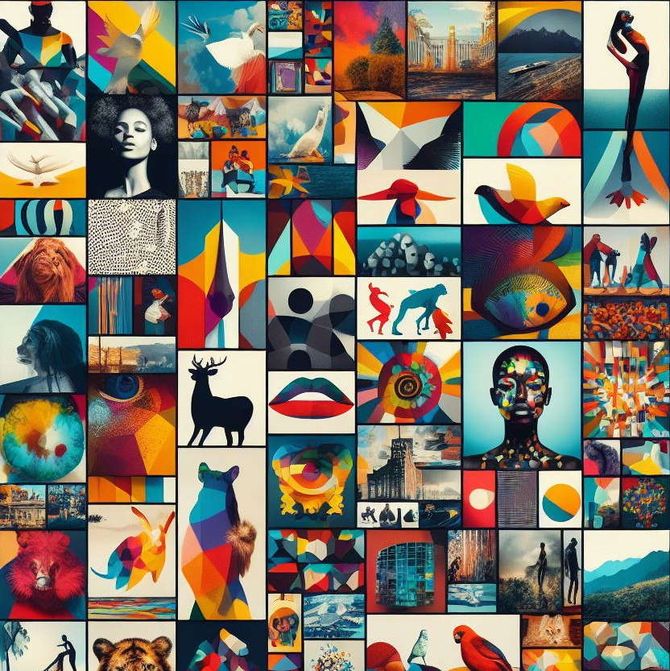
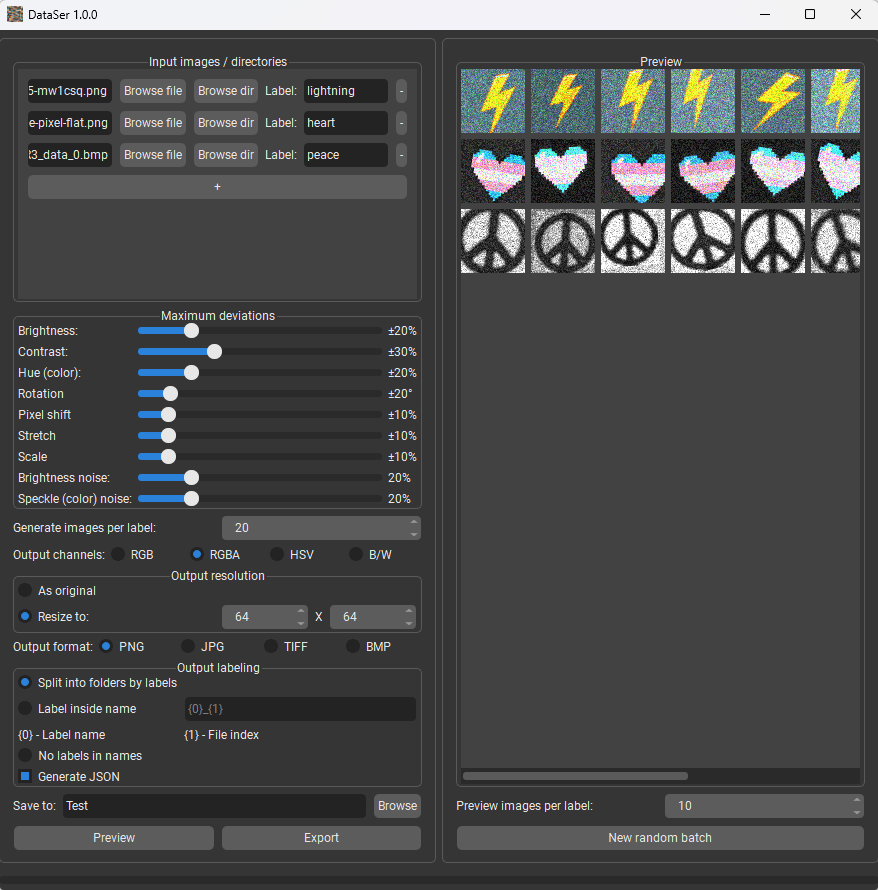

# 📦 DataSer

|  | <h3>Image dataset generator for training neural networks. Capable of randomly modifying various image parameters, enhancing the image dataset</h3> |
|-------------------------------------------------------------|:--------------------------------------------------------------------------------------------------------------------------------------------------:|

----------

## 🏗️ Requirements

- Python 3.10
- opencv-python ~= 4.8.1.78
- PyQt5 ~= 5.15.10
- QtModernRedux ~= 0.9.12
- numpy >= 1.26.1
- pyinstaller ~= 6.1.0 *(for building only)*

----------

## 📦 Getting started

1. For Windows (for now), you can use the pre-built executable (.exe) in the releases section
2. For other OS, please read the "🔨 Build from source" section

1. Add files (or collections of files) for each label using the "+" button. For each file/collection, specify the label to be assigned to the generated files
2. Set the "Maximum deviations"
3. Specify how many images need to be generated using the "Generate images per label" field
4. Specify the output channels, the size of the generated images, format, and output labeling
5. Specify the folder in which to save the dataset (non-existing folders will be created automatically)
6. Click "Preview" to preview the generated images
7. Click "Export" to create and save the dataset

----------

## 🔨 Build from source

1. Install Python 3.10, `venv` and `pip`
2. Download source code
3. Create venv `python -m venv venv` / `python3 -m venv venv` / `python3.10 -m venv venv`
4. Activate venv `source venv/bin/activate` / `venv\Scripts\activate.bat`
5. Install requirements `pip install -r requirements.txt --upgrade`
6. Check app using `python main.py`
7. Build executable using `pyinstaller DataSer.spec`

----------

## ✨ Contribution

- Anyone can contribute! Just create a **pull request**

----------

### 🚧 P.S. This project is under development!

- If you find a **bug**, please create an Issue
